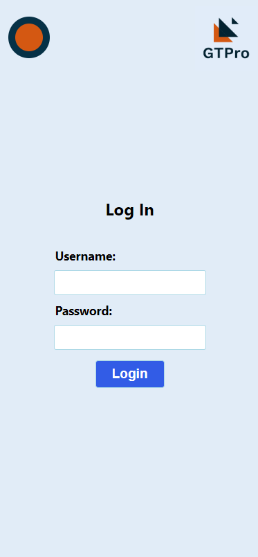
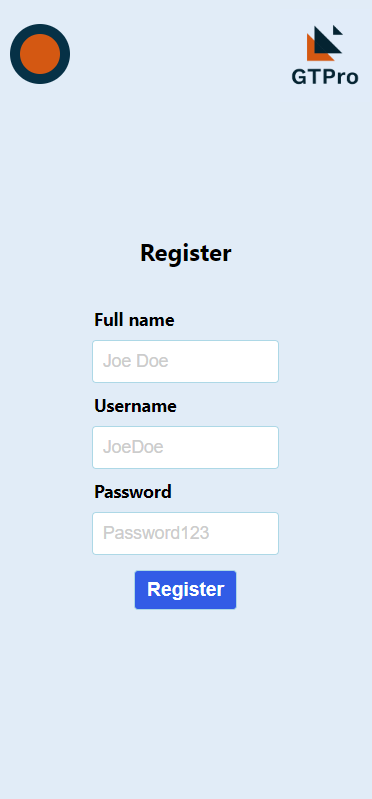
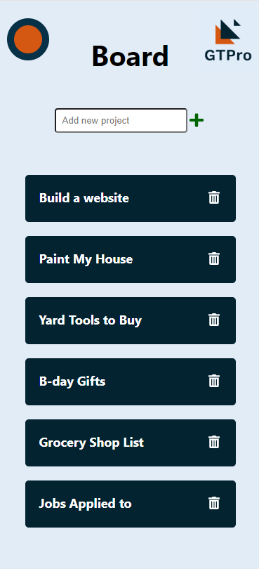
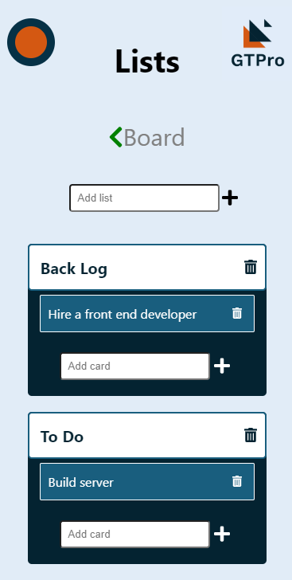

# GTPro

> A project management application

[![Build Status][travis-image]][travis-url]
[![NPM Version][npm-image]][npm-url]

## Live App link

- # https://gtpro-app.com/

## Live Api Link

- # https://sheltered-savannah-63454.herokuapp.com

- Client deployed on zeit
- Server deployed on Heroku

## App Images

  
  
  
  
  

## Summary

GTPro is a project management application that allows people to keep track of their personal and work to-do lists and projects. When logged in, one can start creating projects in his/her board in order to keep track of his/her to-do lists. Each project gives people the ability to create lists and to add cards to each list accordingly.

## Technology Stack

### Front End

- HTML5
- CSS
- JavaScript
- React
- Enzyme
- Redux

### Back End

- Node.js
- Express
- Mocha
- Chai
- PostgreSQL
- Passport
- JWT Authentication

### Development Environment

- Git
- GitHub
- Postman
- DBeaver
- Visual Studio Code
- GitHub Projects

## API Documentation

### API endpoints

- POST to '/api/auth/login' authenticate and login returning user
- POST to '/api/users' inserts a new user into database
- GET to '/api/users' get all users from database
- GET to '/api/user/:id' get a user by id
- DELETE to '/api/user/:id' delete a user by id
- PATCH to '/api/user/:id' update a user by id
- GET to '/api/cards' get all cards from database
- GET to /api/cards/list/:list_id get a card by list id
- GET to '/api/cards/:card_id' get a card by id
- POST to '/api/cards' insert a card into the database
- DELETE to '/api/cards/:card_id' delete a card by id
- PATCH to '/api/cards/:card_id' update a card by id
- GET to '/api/lists' get all lists from database
- GET to /api/lists//project/:project_id get a list by project id
- GET to '/api/lists/:list_id' get a list by id
- POST to '/api/lists' insert a list into the database
- DELETE to '/api/lists/:list_id' delete a list by id
- PATCH to '/api/lists/:list_id' update a list by id
- GET to '/api/projects' get all projects from database
- GET to /api/projects/user/:user_id get a project by user id from database
- GET to '/api/projects/:project_id' get a project by id from database
- POST to '/api/projects' insert a project into the database
- DELETE to '/api/projects/:project_id' delete a project by id from database
- PATCH to '/api/projects/:project_id' update a project by id from database

<!-- Markdown link & img dfn's -->

[npm-image]: https://img.shields.io/npm/v/datadog-metrics.svg?style=flat-square
[npm-url]: https://npmjs.org/package/datadog-metrics
[travis-image]: https://img.shields.io/travis/dbader/node-datadog-metrics/master.svg?style=flat-square
[travis-url]: https://travis-ci.org/dbader/node-datadog-metrics

---
